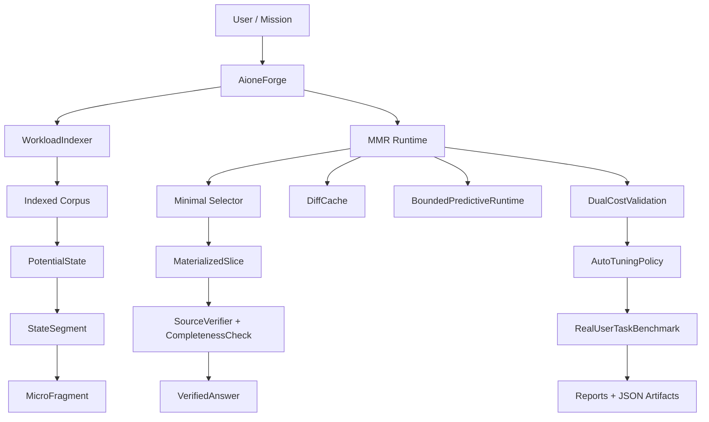

# Architecture AIONE MMR

Version: v30 experimental release

## Schema Logique



## Pipeline Runtime

```text
input ou tache
  -> indexation workload
  -> empreintes fichiers/chunks
  -> selection de fragments pertinents
  -> choix du mode runtime
  -> materialisation minimale
  -> verification sources/completude
  -> mesure cout relatif + cout absolu
  -> rapport Markdown + artefact JSON
```

Modes compares dans v30:

- naive full scan;
- MMR minimal;
- DiffCache;
- MicroDelta;
- bounded predictive;
- auto tuned.

## Composants

### PotentialState

`PotentialState` represente un etat logique vivant. Il porte un fingerprint, une version memoire et des invalidateurs. L'objectif est de reutiliser un etat coherent au lieu de recalculer tout le corpus.

Role:

- conserver l'etat logique compressible;
- detecter les changements de version;
- servir de racine aux slices materialisees.

### MaterializedSlice

`MaterializedSlice` est la partie observee d'un etat potentiel. Elle est liee a une requete, a des sources et a un score de coherence.

Role:

- exposer seulement les fragments utiles;
- garder les references source;
- permettre la verification qualite/cout.

### MicroFragment

`MicroFragment` decoupe un `StateSegment` en fragments plus fins. Une slice peut dependre de certains microfragments seulement.

Role:

- eviter de reconstruire tout un segment;
- mesurer la divergence micro-structurelle;
- isoler les slices affectees par une mutation.

### DiffCache

`DiffCache` transforme le cache documentaire en cache de resolution relative.

Capacites:

- reuse exact si requete, corpus et scoring restent identiques;
- reuse approximatif si la requete normalisee est assez proche;
- divergence-only si seuls certains fragments changent;
- coherence guard pour forcer la rematerialisation si les termes essentiels ne sont plus couverts.

### BoundedPredictiveRuntime

`BoundedPredictiveRuntime` prechauffe les fragments probables sous budget strict.

Contraintes:

- `max_active_fragments`;
- `max_prewarmed_fragments`;
- `max_materialized_tokens`;
- `max_latency_ms`;
- penalite de mauvaise prediction.

Objectif:

- anticiper sans exploser le cout absolu;
- limiter les faux positifs de prechauffage;
- conserver une efficacite de scaling.

### DualCostValidation

`DualCostValidation` verifie que le cout relatif ne cache pas une derive absolue.

Mesures:

- tokens materialises;
- fragments reconstruits;
- fragments reutilises;
- operations SQLite;
- latence murale;
- warnings de discrepancy.

Objectif:

- refuser une strategie qui semble bonne en relatif mais coute trop en absolu.

### AutoTuningPolicy

`AutoTuningPolicy` compare plusieurs modes runtime et choisit le meilleur compromis.

Criteres:

- cout relatif;
- latence absolue;
- warnings;
- prediction suspecte;
- fallback vers warm ou cold si besoin.

Objectif:

- adapter la materialisation au contexte au lieu de figer une strategie unique.

### RealUserTaskBenchmark

`RealUserTaskBenchmark` est l'etape v30. Il evalue AIONE sur des taches proches d'un usage agent/codebase.

Taches:

- architecture;
- emplacement feature;
- tests MMR;
- changements recents;
- risques techniques;
- prochaine etape;
- mini rapport source.

Mesures:

- `relative_resolution_cost`;
- `absolute_latency_ms`;
- `evidence_score`;
- `completeness_score`;
- `unsupported_claim_count`;
- `contradiction_count`;
- `task_success_score`;
- `source_coverage_score`.

## Flux De Verification

```text
answer
  -> important sentence split
  -> citation check
  -> source overlap check
  -> simple contradiction check
  -> completeness vs naive full scan
  -> answer quality score
  -> task success score
```

## Artefacts

Rapports majeurs:

- `MMR_REAL_USER_TASK_BENCHMARK.md`;
- `MMR_ANSWER_QUALITY_VERIFICATION.md`;
- `MMR_EXTERNAL_WORKLOAD_ADAPTER.md`;
- `MMR_DUAL_COST_VALIDATION.md`;
- `MMR_LONG_HORIZON_STABILITY.md`.

Artefacts JSON majeurs:

- `mmr_real_user_task_benchmark.json`;
- `mmr_answer_quality_verification.json`;
- `mmr_external_workload_adapter.json`;
- `mmr_dual_cost_validation.json`;
- `mmr_long_horizon_stability.json`.

## Limites Architecturales

- Les composants MMR sont encore majoritairement dans un module unique.
- Les gates qualite sont lexicales et doivent devenir hybrides.
- Le runtime n'appelle pas encore de backend LLM/NVIDIA pour la synthese.
- La prediction reste simulee par heuristiques locales.
- La persistence est suffisante pour le prototype, pas encore pour un cluster distribue.
