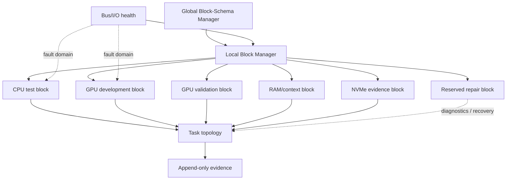

# Task-Specific Block Topology

```mermaid
flowchart TB
    G["Global Block-Schema Manager"] --> L["Local Block Manager"]
    L --> C["CPU test block"]
    L --> G1["GPU development block"]
    L --> G2["GPU validation block"]
    L --> M["RAM/context block"]
    L --> N["NVMe evidence block"]
    L --> R["Reserved repair block"]
    B["Bus/I/O health"] --> L
    C --> W["Task topology"]
    G1 --> W
    G2 --> W
    M --> W
    N --> W
    W --> E["Append-only evidence"]
    B -. fault domain .-> C
    B -. fault domain .-> G1
    R -. diagnostics / recovery .-> W
```

This is a P2 design diagram, not a deployed cluster topology.
