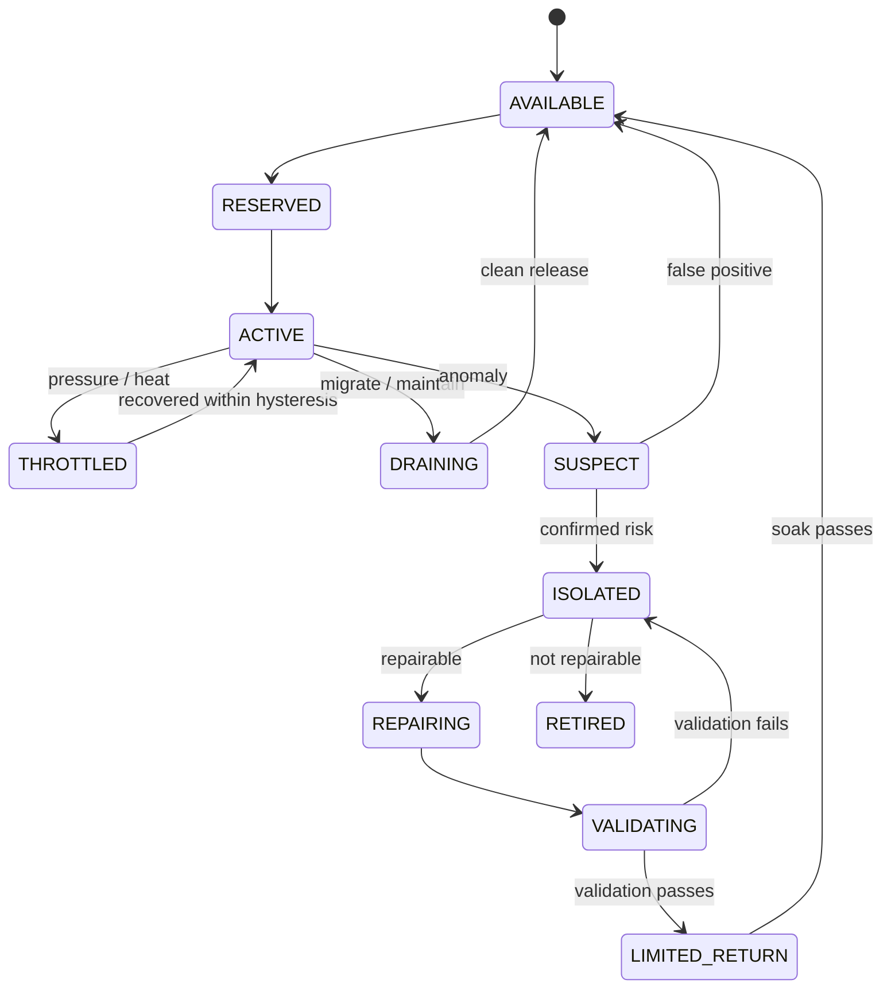

# Block State Model

Status: **P2 documented architecture**.

| State | Meaning | Scheduler behavior |
| --- | --- | --- |
| `AVAILABLE` | Healthy and unreserved | Eligible |
| `RESERVED` | Capacity held for an admitted topology | No competing placement |
| `ACTIVE` | Executing assigned work | Observe continuously |
| `THROTTLED` | Safe but constrained by heat/load/policy | Reduce budget; no expansion |
| `DRAINING` | Finishing/checkpointing before migration or maintenance | Admit no new work |
| `SUSPECT` | Anomaly requires confirmation | Only diagnostic work |
| `ISOLATED` | Removed from productive topologies | Repair/inspection only |
| `REPAIRING` | Bounded repair procedure active | No productive work |
| `VALIDATING` | Post-repair evidence collection | Test workload only |
| `LIMITED_RETURN` | Small guarded production share | Progressive exposure |
| `RETIRED` | Administratively or physically unavailable | Never schedule |

Every transition should append evidence containing reason, observations, policy version, actor, timestamp, and previous-event hash.

