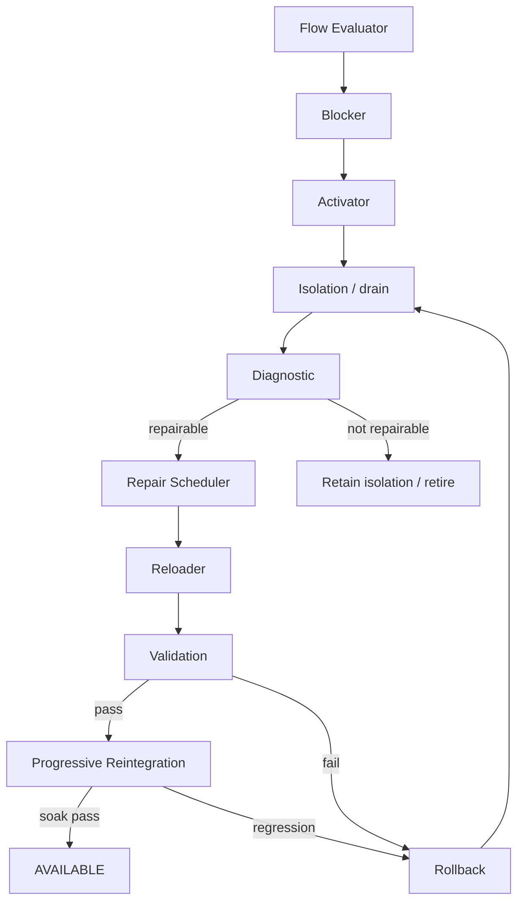

# Recovery Flow

```mermaid
flowchart TD
    O["Flow Evaluator"] --> B["Blocker"]
    B --> A["Activator"]
    A --> I["Isolation / drain"]
    I --> D["Diagnostic"]
    D -->|repairable| R["Repair Scheduler"]
    D -->|not repairable| X["Retain isolation / retire"]
    R --> L["Reloader"]
    L --> V["Validation"]
    V -->|pass| P["Progressive Reintegration"]
    V -->|fail| RB["Rollback"]
    P -->|soak pass| OK["AVAILABLE"]
    P -->|regression| RB
    RB --> I
```

The diagram is P2; linked source implements only selected primitives.

