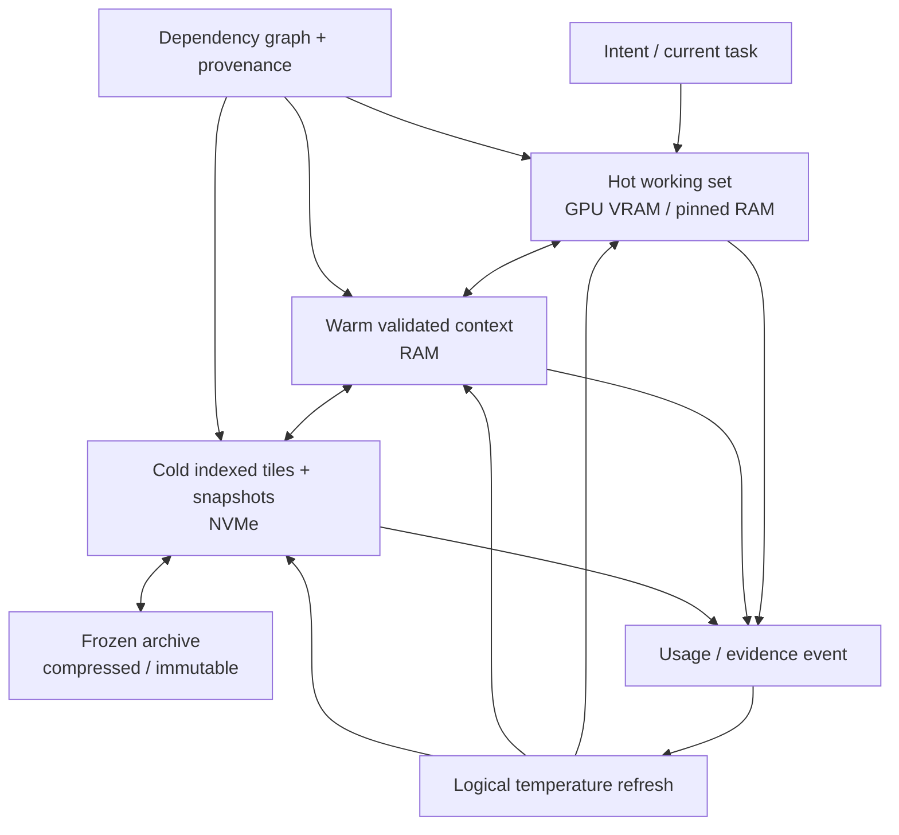

# Memory Hierarchy

```mermaid
flowchart TB
    I["Intent / current task"] --> H["Hot working set\nGPU VRAM / pinned RAM"]
    H <--> W["Warm validated context\nRAM"]
    W <--> C["Cold indexed tiles + snapshots\nNVMe"]
    C <--> F["Frozen archive\ncompressed / immutable"]
    D["Dependency graph + provenance"] --> H
    D --> W
    D --> C
    H --> E["Usage / evidence event"]
    W --> E
    C --> E
    E --> T["Logical temperature refresh"]
    T --> H
    T --> W
    T --> C
```

`Frozen` and automatic physical tiering are architecture-level concepts; the copied implementation uses logical COLD/WARM/HOT/BURNING states.
