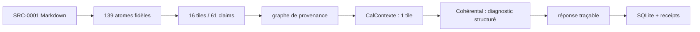

# Rapport d'exécution — premier cycle cognitif vertical

Date : 2026-07-17  
Directive : `SRC-0008:L478-L487`  
Corpus de démonstration : `SRC-0001`  
Question : « Quel rôle Cohérental doit-il réellement jouer ? »

## Résultat

L'exécution canonique `COG-EXE-242CFBBC-9F9E-49F6-8D27-EBBDA67A3AF0` a été arrêtée volontairement à `tiles_built`, puis reprise depuis SQLite jusqu'à `completed`, sans recréer les atomes ni les tiles.

| Artefact | Résultat |
|---|---:|
| Atomes valides | 139 |
| Tiles | 16 |
| Claims | 61 |
| Relations rattachées à l'exécution | 325 |
| Tiles sélectionnées | 1 |
| Receipts WQ-0011 à WQ-0020 | 10 |
| Version d'exécution après reprise | 2 |
| Contrôle de support de réponse | réussi |

Identifiants principaux :

- tile sélectionnée : `TILE-96DB81480963913F` ;
- sélection : `SEL-E7AB7B9F36A40B92` ;
- diagnostic : `DIA-9C93B9AA6E085F11` ;
- réponse : `ANS-4040820616613E25`.

Les receipts machine sont conservés dans `${LOCALAPPDATA}/AIONE/opti-runtime/state/cognitive-receipts/COG-EXE-242CFBBC-9F9E-49F6-8D27-EBBDA67A3AF0/`.

## Modifications livrées

Fichiers et contrats principaux créés :

- source normative normalisée `sources/SRC-0008-cognitive-vertical-cycle-directive.md` ;
- schémas `atom`, `tile`, `cognitive-relation`, `coherence-diagnostic` et `traceable-answer` ;
- implémentation TypeScript sous `src/cognitive/` ;
- cinq fichiers de tests sous `tests/cognitive/` ;
- entrées PowerShell `invoke-cognitive.ps1`, `test-cognitive.ps1` et `test-all.ps1` ;
- guide, présent rapport et quatre fiches de tranche dans les modules concernés.

Fichiers de contrôle modifiés : `PROJECT_STATE.md`, `WORK_QUEUE.yaml`, `MASTER_MODULE_REGISTRY.yaml`, `ARCHITECTURE_GRAPH.yaml`, `SOURCE_MANIFEST.yaml`, `DECISION_LOG.md`, `ASSUMPTION_REGISTER.md`, `CONTRADICTION_REGISTER.md`, `OPEN_QUESTIONS.md`, `DOCUMENTATION_COVERAGE.md`, `README.md`, les contrats/preuves des modules concernés, `package.json`, la configuration et les scripts de build. Le client Ollama existant expose désormais la réponse brute à l'appelant après validation.

Migration SQLite additive, dans la base existante :

- `cog_sources`, `cog_atoms`, `cog_tiles`, `cog_claims`, `cog_relations` ;
- `cog_selections`, `cog_diagnostics`, `cog_answers` ;
- `cog_executions`, `cog_receipts`, `cog_model_runs` ;
- index source/validité et source/sujet, mode WAL, synchronisation `FULL`, clés étrangères et timeout de verrou.

Commandes ajoutées : `run`, `ask`, `resume`, `ingest`, `atoms`, `tiles`, `relations`, `propose`, `diagnostic`, `answer`, `receipt`, `audit-receipts`, `result` et `status` via `scripts/invoke-cognitive.ps1`.

## Chaîne vérifiée

Les relations matérialisent `contains`, `derived_from`, `supports` et `used_in_response`. Les extrémités orphelines sont refusées ; les cycles non autorisés sur `depends_on` et `implies` sont refusés.

## Sélection CalContexte

La tile Cohérental a été sélectionnée avec :

- lexical : `0.0148` ;
- semantic : `null` ;
- subject : `1` ;
- dependency : `0` ;
- source_authority : `1` ;
- epistemic : `1` ;
- freshness : `1` ;
- contradiction : `0` ;
- total : `0.6544`.

Les quinze autres tiles ont été exclues : aucune correspondance de sujet et recouvrement lexical inférieur à `0.1`. L'autorité de SRC-0001 ne suffit donc pas, à elle seule, à inclure du contexte non pertinent. Cette politique de sous-scores explicites vient de `SRC-0008:L361-L379`.

## Diagnostic Cohérental

Le diagnostic n'est pas un score unique :

- 5 claims compatibles ;
- 0 tension détectée ;
- 0 contradiction détectée ;
- 2 dépendances/frontières manquantes ;
- 2 ambiguïtés de définition ;
- 0 inférence non supportée ;
- 0 doublon ;
- 0 claim obsolète ;
- 4 résolutions suggérées et traçables.

Le refus d'un score unique est une exigence de la directive `SRC-0008:L87-L88` et non une affirmation historique attribuée à SRC-0001.

## Réponse produite

La conclusion machine est volontairement limitée : « La définition opérationnelle complète de Cohérental demeure inconnue dans cette source. » Elle est supportée par les claims provenant de `SRC-0001:L273-L278` et `SRC-0001:L180-L192` : la source dit que la raison de la séparation Cohérental/CorrexAI n'est pas connue et interdit de fusionner silencieusement les concepts attestés.

Le pipeline ne transforme donc pas l'exemple normatif de SRC-0008 en souvenir historique. Il refuse de répondre « quel rôle réellement » au-delà de ce que SRC-0001 permet d'établir.

Artefacts utilisés par la réponse finale :

- tile : `TILE-96DB81480963913F` ;
- atomes : `ATM-B54EB87962C57E96`, `ATM-129D2A05D115D566` ;
- claims explicites : `CLM-BA162C55DC8FC8DC`, `CLM-CF03FA44EF3DF7B1` ;
- incertitudes : définition opérationnelle absente et frontière Cohérental/CorrexAI non justifiée dans SRC-0001.

## Tests

Suite déterministe : 13 tests découverts, 12 réussis, 1 test Ollama explicitement ignoré dans cette commande. Les cas couverts incluent Markdown irrégulier, Unicode, répétitions, source absente ou vide, YAML invalide, base verrouillée, atome orphelin, cycle interdit, sortie de proposition invalide, modèle indisponible, affirmation non supportée, idempotence et reprise.

Suite Ollama réelle : 1 test réussi avec `qwen2.5-coder:14b`. Une proposition réelle a ensuite été rattachée à l'exécution canonique sous `MODRUN-CDEB1C75D03AC129`. Elle ne contient que des identifiants d'atomes fournis et du contenu verbatim autorisé ; modèle, prompt hashé, paramètres, sortie brute et sortie validée sont persistés dans `cog_model_runs`.

## Limites et suite sûre

- L'absence d'embeddings interdit de qualifier la sélection de sémantique.
- Le graphe construit la provenance du corpus importé ; il ne formalise pas encore toutes les dépendances de domaine.
- Les implémentations TileMindFS, CalContexte et Cohérental sont des projections bornées `TESTED` de la tranche, tandis que les modules historiques restent globalement `PARTIALLY_DEFINED`.
- La prochaine extension cognitive requiert une nouvelle autorisation explicite dans `PROJECT_STATE.md`.

## Prochaines tâches autorisées

- reprendre WQ-0001 : importer toute source historique réellement disponible ;
- poursuivre WQ-0002 à WQ-0006 sur le plan documentaire, avec références de lignes et modalités ;
- rechercher et spécifier OQ-0019 (sous-score sémantique), sans l'implémenter avant autorisation ;
- rechercher et spécifier OQ-0020 (formation générale des tiles), sans promouvoir le canari en contrat TileMindFS.

Aucune deuxième tranche cognitive n'est devenue implicitement autorisée.
