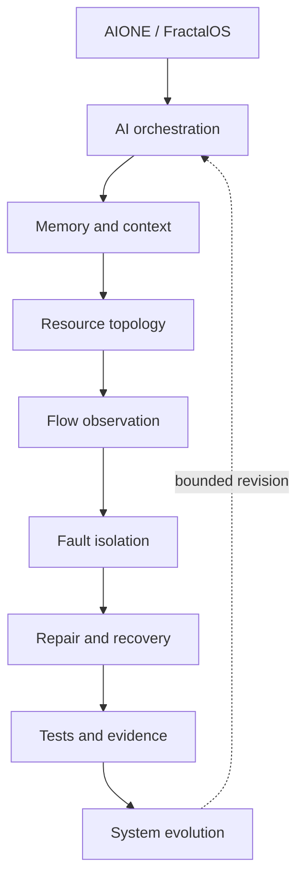

# Architecture Overview

## Cross-system view

The repository contains two complementary implementation lines. AIONE supplies local AI orchestration, controlled research, model routing, thermal context, evidence, and recovery governors. FractalOS supplies a local runtime/OS experiment with heterogeneous scheduling, GPU and mesh abstractions, memory tiers, snapshot/rollback behavior, and an early bare-metal kernel. The requirement repository supplies the control discipline that separates sourced requirements, contracts, implemented kernels, and unresolved questions.

## Dependency view

```mermaid
flowchart LR
    R["Requirements and source manifest"] --> C["Contracts and state machines"]
    C --> P["Planning and admission"]
    P --> S["CPU/GPU scheduler"]
    P --> M["Model router"]
    M --> X["Context materialization"]
    S --> X
    X --> W["Work execution"]
    W --> O["Observation and ledgers"]
    O --> F["Fault classification"]
    F --> Q["Isolation / bounded repair"]
    Q --> V["Validation"]
    V -->|pass| RI["Progressive reintegration"]
    V -->|fail| RB["Rollback / retained isolation"]
    RI --> E["Evidence and revision"]
    RB --> E
```

Implemented pieces exist at most stages, but the diagram is a transverse synthesis rather than one deployed monolith. Exact links and evidence levels are in the [Evidence Matrix](EVIDENCE_MATRIX.md).

## Trust boundaries

- Canonical source and isolated workspaces are separate.
- External publication, dependency installation, model download, and canonical mutation are disabled in the copied dual-GPU policy.
- Loopback endpoints are used for local model services.
- Append-only events, hashes, test receipts, and retained generations support audit and rollback.
- Human review is required before canonical promotion in the selected configuration.

## Key limitations

- The hardware topology is one workstation with two GPUs, not a datacenter cluster.
- Mesh and block-resource concepts are prototypes or architecture, not demonstrated multi-node production systems.
- Historical benchmark reports are not independent third-party validation.
- The bare-metal line is early and explicitly not a daily-use replacement OS.
- “Evolution” means bounded proposal, testing, and revision workflows; it does not imply unconstrained self-modification.

